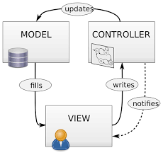

# Laporan Modul 1: Perkenalan Laravel
*Mata Kuliah:* Workshop Web Lanjut   
*Nama:* [Irfandi]  
*NIM:* [2024573010071]  
*Kelas:* [TI-2C]  

---

## Abstrak 
Tuliskan ringkasan singkat tentang isi laporan ini dan tujuan Anda membuat laporan.

---

## 1. Pendahuluan
- Tuliskan teori perkenalan tentang laravel
- Apa itu Laravel?
Laravel adalah framework PHP modern yang digunakan untuk membangun aplikasi web. Framework ini bersifat open-source dan dirancang untuk mempermudah pengembangan dengan sintaks yang elegan, rapi, serta memiliki banyak fitur bawaan.

- Karakteristik utama (MVC, opinionated, dsb.)
Berbasis MVC (Model–View–Controller): memisahkan logika aplikasi (Model), tampilan (View), dan pengendali alur (Controller).

Opinionated framework: Laravel memiliki “aturan main” atau standar tertentu yang membantu developer menjaga konsistensi kode.

Banyak fitur bawaan: autentikasi, routing, ORM, templating, testing, dan masih banyak lagi.

- Untuk jenis aplikasi apa Laravel cocok?
Untuk Jenis Aplikasi Apa Laravel Cocok?
Laravel cocok digunakan untuk aplikasi web berskala kecil hingga besar, mulai dari website company profile, blog, e-commerce, sistem manajemen, hingga aplikasi web dengan API modern.

---

## 2. Komponen Utama Laravel (ringkas)
Tuliskan penjelasan singkat (1–3 kalimat) untuk tiap komponen berikut:
- Blade (templating)Sistem templating bawaan Laravel untuk membuat tampilan dinamis dengan sintaks sederhana.

- Eloquent (ORM)Fitur untuk mengelola database menggunakan model PHP tanpa perlu menulis query SQL secara manual.

- Routing Mengatur jalur URL aplikasi dan menghubungkannya dengan controller atau closure.

- Controllers  Menangani logika aplikasi dan menjadi penghubung antara model dan view.

- Migrations & Seeders
Migration digunakan untuk mengatur struktur database secara versioning, sedangkan Seeder digunakan untuk mengisi data awal secara otomatis.

- Artisan CLI
 Command Line Interface bawaan Laravel untuk mempercepat pengembangan (misalnya membuat model, controller, migration).

- Testing (PHPUnit)
Laravel menyediakan integrasi dengan PHPUnit untuk melakukan pengujian otomatis pada aplikasi.

Middleware: Lapisan logika yang bisa ditempatkan di antara request dan response (contoh: autentikasi).

(Tambahkan komponen lain jika ingin)

---

## 3. Berikan penjelasan untuk setiap folder dan files yang ada didalam struktur sebuah project laravel.
app/ → berisi kode utama aplikasi (Models, Controllers, Middleware).

bootstrap/ → memuat file untuk inisialisasi aplikasi.

config/ → berisi file konfigurasi (database, cache, mail, dll.).

database/ → menyimpan migrations, seeders, dan factories.

public/ → berisi file publik yang bisa diakses browser (index.php, asset seperti CSS, JS, gambar).

resources/ → menyimpan view (Blade template), file bahasa, dan asset mentah.

routes/ → berisi definisi routing aplikasi (web.php, api.php, console.php).

storage/ → tempat penyimpanan file yang dihasilkan aplikasi (log, cache, uploads).

tests/ → tempat untuk menulis unit test atau feature test.

vendor/ → berisi semua package/library yang diinstal melalui Composer.

File penting di root project:

.env → konfigurasi environment (database, app key, dsb.).

composer.json → daftar dependency project.

artisan → file CLI untuk menjalankan perintah Laravel.

---

## 4. Diagram MVC dan Cara kerjanya

> Letakkan gambar di dalam folder laporan1/gambar/. Kemudian masukkan gambar tersebut ke laporan.

---

## 6. Kelebihan & Kekurangan (refleksi singkat)
- Kelebihan Laravel menurut Anda
Memiliki struktur MVC yang rapi sehingga memudahkan pengembangan aplikasi.

Dokumentasi resmi yang lengkap dan komunitas besar, jadi mudah mencari solusi.

Fitur bawaan seperti Eloquent ORM, Blade Template, Routing, dan Middleware yang membuat pengembangan lebih cepat.

Mendukung keamanan aplikasi (CSRF, XSS, enkripsi password dengan bcrypt, dll).

Ekosistem luas (Laravel Mix, Passport, Horizon, dll) yang bisa disesuaikan dengan kebutuhan.

Hal yang mungkin menjadi

- Hal yang mungkin menjadi tantangan bagi pemula
Proses instalasi dan setup awal bisa membingungkan, terutama jika belum terbiasa dengan Composer, PHP, atau server lokal.

Banyaknya fitur kadang membuat bingung pemula untuk memilih mana yang harus dipelajari lebih dulu.

Konsep OOP (Object-Oriented Programming) yang mendalam, seperti penggunaan model, relasi, dan dependency injection, mungkin sulit dipahami di awal.

Membutuhkan resource komputer yang cukup tinggi saat menjalankan proyek.

---

## 7. Referensi
Cantumkan sumber yang Anda baca (buku, artikel, dokumentasi) — minimal 2 sumber. Gunakan format sederhana (judul — URL).
Laravel Documentation — https://laravel.com/docs

"Laravel: Up and Running" (Matt Stauffer) — https://www.oreilly.com/library/view/laravel-up/9781491936075/

Artikel Tutorial Laravel Indonesia — https://www.malasngoding.com/category/laravel/