Laporan Modul 2: Laravel Fundamentasl
*Mata Kuliah:* Workshop Web Lanjut   
*Nama:* [IRFANDI]  
*NIM:* [2024573010071]  
*Kelas:* [TI-2C]  

---

## Abstrak 
Laporan ini membahas dasar penggunaan framework Laravel khususnya konsep MVC, routing, middleware, serta proses request–response. Praktikum yang dilakukan meliputi pembuatan route, controller, dan view sederhana menggunakan Blade, serta implementasi aplikasi kalkulator sederhana. Tujuan laporan ini adalah untuk memahami alur kerja Laravel dan mengaplikasikan konsep MVC pada pengembangan aplikasi berbasis web.

---

## 1. Dasar Teori
- Apa itu MVC (Model, View, Controller).
MVC adalah pola arsitektur yang memisahkan logika aplikasi ke dalam tiga bagian utama:
Model: Mengelola data dan logika bisnis.
View: Menampilkan data ke pengguna.
Controller: Menjembatani antara Model dan View dengan menangani request dari user.

- Konsep Routing di Laravel.
Routing adalah mekanisme yang menentukan bagaimana aplikasi merespons sebuah URL atau permintaan HTTP tertentu. Di Laravel, routing didefinisikan pada file routes/web.php.

- Fungsi Middleware.
Middleware adalah lapisan perantara antara request dan response. Middleware digunakan untuk memeriksa atau memodifikasi request, misalnya autentikasi, logging, atau proteksi CSRF.

- Bagaimana cara Laravel menangani Request dan Response.
Laravel menerima request dari browser melalui routing, lalu diteruskan ke controller untuk diproses. Hasil pemrosesan akan dikembalikan dalam bentuk response (HTML, JSON, atau lainnya) ke browser.

- Peran Controller dan View.
Controller: Mengatur logika aplikasi, memproses data, dan mengarahkan ke view.

View: Bertugas menampilkan data dalam bentuk antarmuka yang dapat dilihat pengguna.

- Fungsi Blade Templating Engine.
Blade adalah template engine bawaan Laravel. Fungsinya adalah untuk memudahkan pembuatan tampilan dengan sintaks sederhana, mendukung inheritance, dan memungkinkan integrasi PHP dalam file view.
---

## 2. Langkah-Langkah Praktikum
Tuliskan langkah-langkah yang sudah dilakukan, sertakan potongan kode dan screenshot hasil.

2.1 Praktikum 1 – Route, Controller, dan Blade View
pertama buka project yang sudah kita buat dan buka  routes/web.php
- Tambahkan route pada routes/web.php.
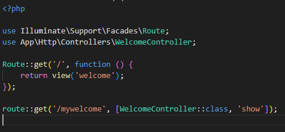
- Buat controller WelcomeController.
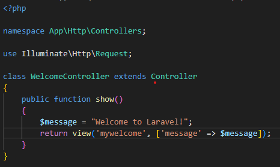
- Buat view mywelcome.blade.php.
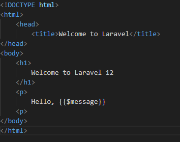
- Jalankan aplikasi dan tunjukkan hasil di browser.
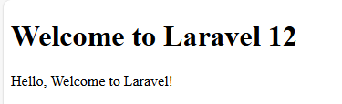

Screenshot Hasil:

2.2 Praktikum 2 – Membuat Aplikasi Sederhana "Calculator"

- Tambahkan route untuk kalkulator.
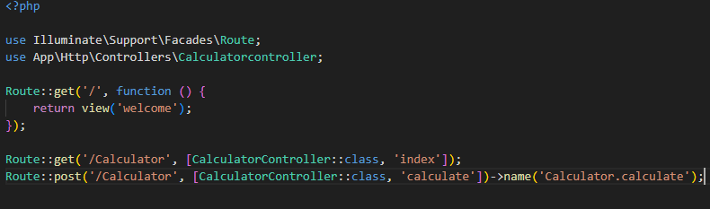
- Buat controller CalculatorController.
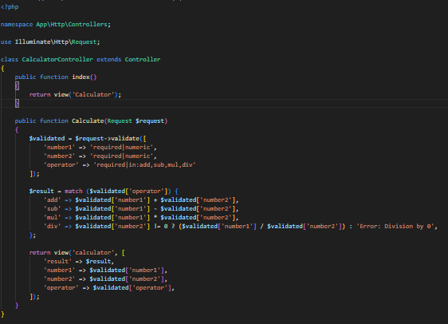
- Tambahkan view calculator.blade.php.
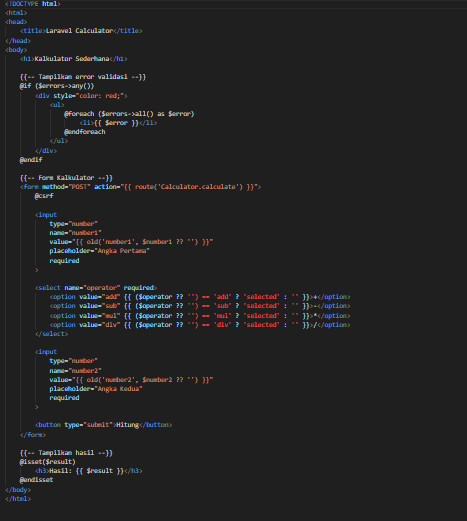
- Jalankan aplikasi dan coba dengan beberapa input berbeda.
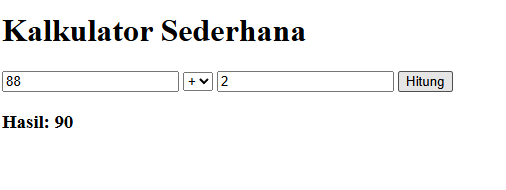
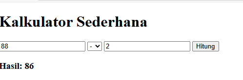
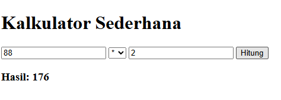
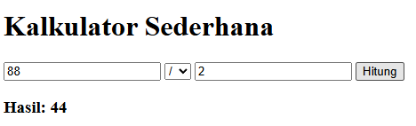

Screenshot Hasil:

---

## 3. Hasil dan Pembahasan
Jelaskan apa hasil dari praktikum yang dilakukan.
- Apakah aplikasi berjalan sesuai harapan?
Aplikasi berhasil berjalan sesuai harapan, route menampilkan halaman yang benar, dan controller mengembalikan view.
- Apa yang terjadi jika ada input yang salah (misalnya pembagian dengan 0)?
Jika terjadi input salah (misalnya pembagian dengan 0), sistem menampilkan pesan error: "Error: Pembagian dengan 0".
- Bagaimana validasi input bekerja di Laravel?
Validasi input dapat dilakukan dengan Request validation Laravel, misalnya menggunakan $request->validate().
- Apa peran masing-masing komponen (Route, Controller, View) dalam program yang dibuat?
Route mengarahkan permintaan.
Controller memproses logika aplikasi.
View menampilkan hasil ke pengguna.

---

## 4. Kesimpulan

Tulis kesimpulan dari praktikum ini
Dari praktikum ini dapat disimpulkan bahwa Laravel memudahkan pengembangan aplikasi web dengan pola MVC. Routing, Controller, dan View bekerja sama dalam menangani request–response. Blade mempermudah pembuatan tampilan, sedangkan validasi input memastikan aplikasi lebih aman dan stabil.

---

## 5. Referensi
Cantumkan sumber yang Anda baca (buku, artikel, dokumentasi) — minimal 2 sumber. Gunakan format sederhana (judul — URL).

1. Laravel Documentation — https://laravel.com/docs
2. Sanjaya, L. (2021). Belajar Laravel 8 untuk Pemula. — https://santrikoding.com

---